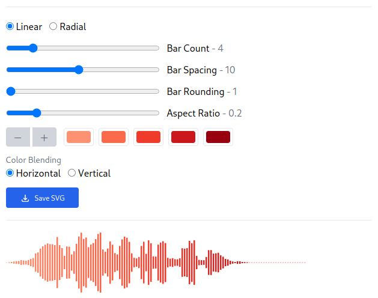

# Wavething

Wavething is a simple audio waveform data visualizer.



Wavething was built with [D3.js](https://d3js.org), [waveform-data.js](https://github.com/bbc/waveform-data.js), and [React](https://reactjs.org/). The sample audio file used is a public domain recording of a [Budgerigar chirping](https://commons.wikimedia.org/wiki/File:Budgerigar_chirping.ogg) from Wikimedia Commons.

## Usage

The app can be run locally using `npm`.

```
$ cd wavething
$ npm install
$ npm run start
```

## Contributing

Contributions to code and documentation are welcome. Please create an issue to discuss significant patches.

## License

See the [LICENSE](LICENSE) file for license rights and limitations (GPL-3.0).
